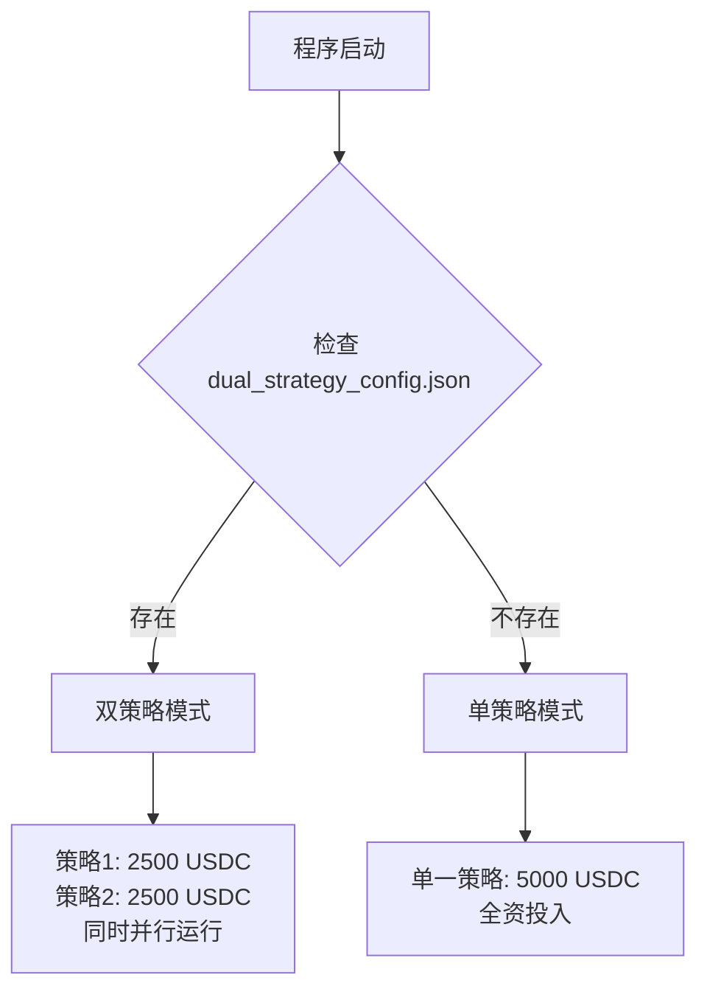

# 🚀 Backpack 智能交易系统

[](https://opensource.org/licenses/MIT)
[](https://nodejs.org/)
[](https://developer.mozilla.org/en-US/docs/Web/JavaScript)
[](https://github.com/xmrjun/mading2)

一个基于 **Backpack 交易所** 的智能自动化交易系统，专为加密货币交易者设计。支持**单策略**和**双策略**两种模式，包含递增买入策略、实时价格监控、自动止盈和风险管理。

## ✨ 核心特性

### 🎯 多策略模式
- **单策略模式**：专注单一交易策略，5000 USDC全资投入
- **双策略模式**：两个策略同时运行，2500+2500 USDC分散风险
- **自动检测**：程序自动检测配置文件并选择运行模式

### 📊 智能交易策略
- **递增买入策略**：根据价格下跌程度，自动增加买入量
- **波动性分析**：实时分析市场波动，选择最适合的策略
- **动态止盈**：达到预设盈利目标自动卖出
- **风险控制**：多层风险控制机制，保护资金安全

### � 高级功能
- **实时监控**：WebSocket 价格流，实时交易统计
- **智能重启**：无订单成交或止盈后自动重启新一轮
- **异常处理**：网络断线、API错误自动重试
- **优雅退出**：支持安全退出和资源清理

## 🏗️ 项目架构

```
backpack-trading-system/
├── src/                        # 源代码目录
│   ├── app/                    # 应用层
│   │   └── dualTradingApp.js   # 双策略应用类
│   ├── config/                 # 配置管理
│   │   └── configLoader.js     # 智能配置加载器
│   ├── core/                   # 核心业务逻辑
│   │   ├── dualTradingStrategy.js # 双策略引擎
│   │   ├── tradingStrategy.js  # 单策略引擎
│   │   ├── orderManager.js     # 订单管理器
│   │   └── priceMonitor.js     # 价格监控器
│   ├── models/                 # 数据模型
│   │   ├── Order.js           # 订单模型
│   │   └── TradeStats.js      # 交易统计模型
│   ├── network/                # 网络通信
│   │   └── webSocketManager.js # WebSocket管理器
│   ├── services/               # 服务层
│   │   └── backpackService.js  # Backpack API服务
│   ├── utils/                  # 工具库
│   │   ├── formatter.js        # 数据格式化
│   │   ├── logger.js          # 日志系统
│   │   └── timeUtils.js       # 时间工具
│   ├── app.js                  # 单策略应用主类
│   └── index.js               # 程序入口
├── scripts/                    # 脚本目录
├── logs/                       # 日志目录
├── backpack_trading_config.json # 单策略配置
├── dual_strategy_config.json   # 双策略配置
├── package.json               # 项目配置
└── README.md                  # 项目文档
```

## 🚀 快速开始

### 1. 环境要求
- **Node.js**: >= 18.0.0
- **npm**: >= 8.0.0
- **Backpack 交易所账户**和 API 密钥

### 2. 安装依赖
```bash
# 克隆项目
git clone https://github.com/xmrjun/mading2.git
cd mading2

# 安装依赖
npm install
```

### 3. 配置 API 密钥

#### 单策略模式配置
编辑 `backpack_trading_config.json` 文件：
```json
{
  "api": {
    "privateKey": "YOUR_PRIVATE_KEY_HERE",
    "publicKey": "YOUR_PUBLIC_KEY_HERE"
  },
  "trading": {
    "tradingCoin": "BTC",
    "maxDropPercentage": 0.6,
    "totalAmount": 5000,
    "orderCount": 5,
    "incrementPercentage": 50,
    "takeProfitPercentage": 0.6
  }
}
```

#### 双策略模式配置
编辑 `dual_strategy_config.json` 文件：
```json
{
  "totalCapital": 5000,
  "enableDualStrategy": true,
  "api": {
    "privateKey": "YOUR_PRIVATE_KEY_HERE",
    "publicKey": "YOUR_PUBLIC_KEY_HERE"
  },
  "strategy1": {
    "name": "高频小波动策略",
    "trading": {
      "tradingCoin": "BTC",
      "maxDropPercentage": 0.8,
      "totalAmount": 2500,
      "takeProfitPercentage": 0.06
    }
  },
  "strategy2": {
    "name": "中频大波动策略",
    "trading": {
      "tradingCoin": "BTC", 
      "maxDropPercentage": 1.5,
      "totalAmount": 2500,
      "takeProfitPercentage": 0.12
    }
  }
}
```

### 4. 启动交易系统

#### 🎯 **方式一：独立启动脚本（推荐）**
```bash
# 启动单策略模式
node start_single.js
# 或者使用 npm 脚本
npm run single

# 启动双策略模式
node start_dual.js
# 或者使用 npm 脚本
npm run dual
```

#### 🔄 **方式二：传统启动（自动检测）**
```bash
# 统一启动命令（自动检测模式）
node src/index.js

# 或使用npm脚本
npm run dev
```

## 🎯 交易模式详解

### 模式1：单策略模式 🎪
**适用场景**：明确的市场方向，专注单一策略
```json
// backpack_trading_config.json
{
  "trading": {
    "tradingCoin": "BTC",
    "maxDropPercentage": 0.6,     // 0.6%下跌触发
    "totalAmount": 5000,          // 5000 USDC全部投入
    "orderCount": 5,              // 5个递增订单
    "incrementPercentage": 50,    // 50%递增幅度
    "takeProfitPercentage": 0.6   // 0.6%止盈
  }
}
```

**特点**：
- 💰 **全资投入**：5000 USDC专注单一策略
- ⚡ **激进策略**：小幅下跌即大幅加仓
- 🎯 **高收益目标**：0.6%止盈，追求快速收益

### 模式2：双策略模式 🎭
**适用场景**：分散风险，两个策略同时运行

**资金分配**：5000 USDC → 2500 + 2500，两个策略并行运行

#### 策略1 - 高频小波动策略 🌊
```json
{
  "strategy1": {
    "name": "高频小波动策略",
    "trading": {
      "maxDropPercentage": 0.8,    // 0.8%下跌触发
      "totalAmount": 2500,         // 2500 USDC
      "takeProfitPercentage": 0.06 // 0.06%止盈
    },
    "advanced": {
      "maxDailyTrades": 8          // 每日最多8次
    }
  }
}
```

#### 策略2 - 中频大波动策略 🌊🌊
```json
{
  "strategy2": {
    "name": "中频大波动策略",
    "trading": {
      "maxDropPercentage": 1.5,    // 1.5%下跌触发
      "totalAmount": 2500,         // 2500 USDC
      "takeProfitPercentage": 0.12 // 0.12%止盈
    },
    "advanced": {
      "maxDailyTrades": 5          // 每日最多5次
    }
  }
}
```

**并行运行特点**：
- � **同时运行**：两个策略各自独立运行，互不干扰
- 💰 **资金分离**：策略1管理2500，策略2管理2500
- 🎯 **不同触发**：策略1抓小波动，策略2抓大波动
- 🛡️ **分散风险**：不同的止盈止损设置，降低整体风险


## ⚙️ 配置文件详解

### 🔧 智能检测逻辑

程序启动时按以下顺序自动检测：



### 📊 配置对比表

| 配置项 | 单策略模式 | 双策略模式 |
|-------|-----------|-----------|
| **配置文件** | `backpack_trading_config.json` | `dual_strategy_config.json` |
| **资金分配** | 5000 USDC 全资投入 | 2500+2500 USDC 分散投资 |
| **策略数量** | 1个激进策略 | 2个策略并行运行 |
| **风险特点** | 高风险高收益 | 分散风险，稳定收益 |
| **交易频率** | 无限制 | 策略1:8次/日, 策略2:5次/日 |
| **适用场景** | 明确趋势，追求快速收益 | 市场不确定，分散风险 |

### 🎛️ 高级配置选项

```json
{
  "riskControl": {
    "maxDailyLoss": 200,          // 每日最大亏损限制
    "maxConsecutiveLosses": 3,    // 最大连续亏损次数
    "cooldownAfterLoss": 30,      // 亏损后冷却时间(分钟)
    "emergencyStopLoss": 500      // 紧急止损限制
  },
  "websocket": {
    "url": "wss://ws.backpack.exchange",
    "options": {
      "reconnect": true,
      "reconnectInterval": 3000,
      "maxReconnectAttempts": 5
    }
  }
}
```

## 📈 使用场景推荐

### ⚡ 激进型交易者  
**推荐**：单策略模式
```bash
# 使用 backpack_trading_config.json
# 当前激进配置：0.6%触发，50%递增，0.6%止盈
```
**优势**：5000 USDC全资投入，快速收益，适合明确趋势

### 🛡️ 稳健型交易者
**推荐**：双策略模式
```bash
# 使用 dual_strategy_config.json  
# 资金分配：2500 + 2500
```
**优势**：分散风险，两个策略并行运行，稳定收益

## 🛠️ 开发指南

### 本地开发
```bash
# 开发模式运行
npm run dev

# 启动测试
npm test

# 查看日志
tail -f logs/backpack_trading_$(date +%Y-%m-%d).log
```

### 自定义策略
```javascript
// 在 src/core/dualTradingStrategy.js 中
class CustomStrategy extends SingleStrategy {
  async evaluate(currentPrice, volatility) {
    // 自定义策略评估逻辑
    return {
      shouldExecute: true,
      confidence: 0.8,
      parameters: { /* 自定义参数 */ }
    };
  }
}
```

### 监控系统状态
```bash
# 实时查看交易状态
node src/index.js

# 查看详细日志
tail -f logs/*.log

# 检查配置
cat backpack_trading_config.json
cat dual_strategy_config.json
```

## 🔒 安全注意事项

### API 密钥安全
- ✅ 定期轮换 API 密钥
- ✅ 设置 API 权限最小化
- ✅ 不要在公共环境提交密钥
- ❌ 永远不要硬编码密钥

### 交易风险管理
- ⚠️ **资金风险**：加密货币交易存在高风险
- ⚠️ **测试建议**：先用小额资金测试所有策略
- ⚠️ **监控重要**：定期检查交易状态和持仓
- ⚠️ **止损设置**：确保设置合理的止损位

### 配置文件安全
```gitignore
# .gitignore 示例
*config*.json
.env
logs/
*.log
```

## 📊 性能监控

### 实时统计
系统提供实时的交易统计信息：

**单策略模式**：
```
===== Backpack 自动交易系统 =====
交易对: BTC_USDC
总订单数: 5
已成交订单: 1  
成交总金额: 378.17 USDC
成交总数量: 0.003500 BTC
当前持仓价值: 377.86 USDC
盈亏金额: ↓ 0.31 USDC
```

**双策略模式**：
```
=== 双策略统计信息 ===
总交易次数: 3
总盈利: 15.60 USDC
净盈利: 12.40 USDC

--- 策略1统计 ---
名称: 高频小波动策略
交易次数: 2
盈利: 8.20 USDC
成功率: 85.5%

--- 策略2统计 ---  
名称: 中频大波动策略
交易次数: 1
盈利: 7.40 USDC
成功率: 90.0%
```

## 🤝 贡献指南

### 提交代码
1. Fork 项目
2. 创建特性分支: `git checkout -b feature/new-strategy`
3. 提交更改: `git commit -m 'Add new trading strategy'`
4. 推送分支: `git push origin feature/new-strategy`
5. 创建 Pull Request

### 报告问题
- 使用 GitHub Issues 报告 bug
- 提供详细的错误信息和配置
- 包含日志文件和系统环境

## 📝 更新日志

### v3.0.0 (2024-12-05) 🎉
- 🆕 **双策略模式**：支持两个策略同时并行运行
- 🆕 **智能配置检测**：自动检测并选择运行模式
- 🆕 **资金分离管理**：双策略模式下2500+2500资金分离
- 🔧 **风险控制增强**：分散风险，独立管理
- 📊 **统计系统优化**：双策略独立统计和全局统计

### v2.0.0 (2024-01-01)
- 🎉 全新模块化架构
- ✨ 实时 WebSocket 监控
- 🔧 优化交易策略引擎
- 📊 改进统计和日志系统

## 📞 支持与联系

- **GitHub**: [xmrjun/mading2](https://github.com/xmrjun/mading2)
- **Issues**: [报告问题](https://github.com/xmrjun/mading2/issues)
- **文档**: [Wiki文档](https://github.com/xmrjun/mading2/wiki)

## 📄 许可证

本项目采用 MIT 许可证 - 查看 [LICENSE](LICENSE) 文件了解详情。

## ⚠️ 免责声明

本项目仅供学习和研究使用。加密货币交易存在高风险，可能导致资金损失。使用本软件进行交易时，请：

1. **充分了解风险**：加密货币市场波动剧烈
2. **小额测试**：先用小额资金测试所有功能
3. **定期监控**：持续关注交易状态和市场变化
4. **遵守法规**：确保符合当地法律法规

**作者不对使用本软件造成的任何损失承担责任。投资有风险，入市需谨慎！**

---

## 🌟 Star History

如果这个项目对您有帮助，请给我们一个 ⭐️ 支持！

[](https://star-history.com/#xmrjun/mading2&Date)

---

**开始您的智能交易之旅！选择最适合的策略模式，让AI为您自动交易。** 🚀✨ 